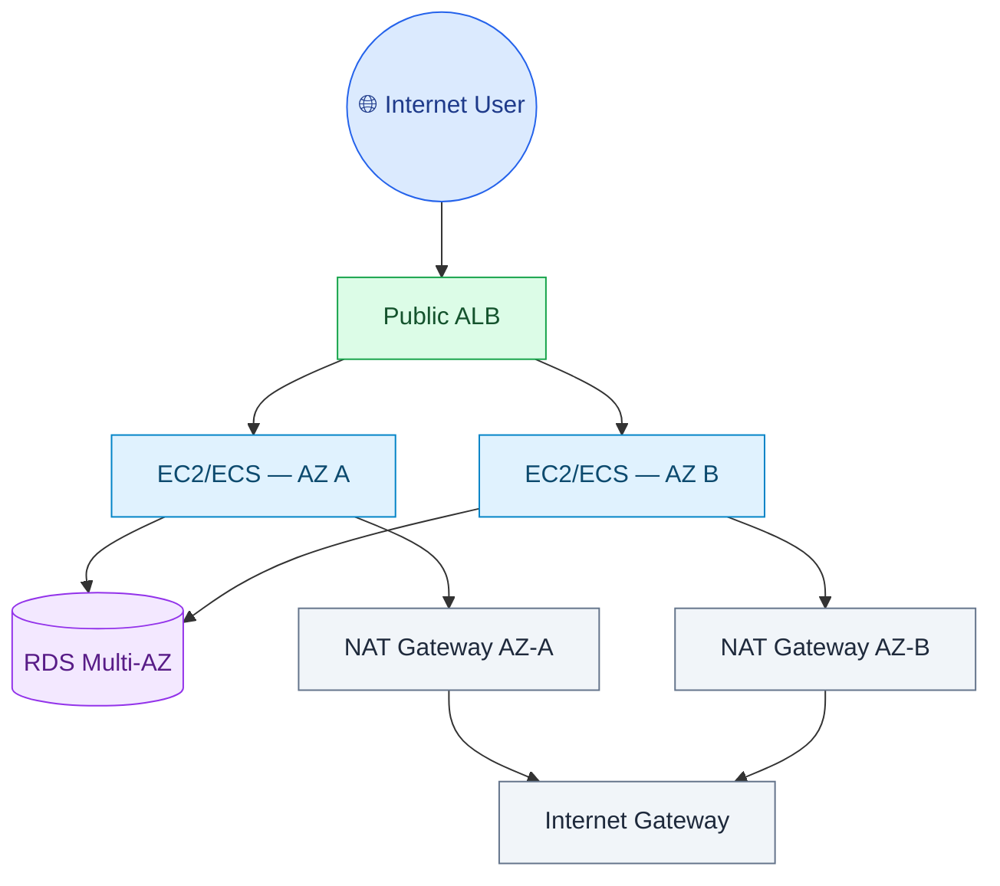

# Networking

Networking là phần ăn điểm lớn vì nó chạm cả security, resilience, performance và cost. Hãy nắm VPC thật chắc trước khi học service khác.

## VPC Core

| Thành phần | Vai trò | Bẫy đề |
|---|---|---|
| VPC | mạng riêng trong một Region | Không span nhiều Region |
| Subnet | chia CIDR trong một AZ | Subnet luôn thuộc một AZ |
| Public subnet | route tới Internet Gateway | Resource vẫn cần public IP hoặc LB public |
| Private subnet | không route trực tiếp internet inbound | Outbound cần NAT Gateway hoặc endpoint |
| Route table | quyết định đường đi packet | Route cụ thể hơn thắng route rộng hơn |
| Internet Gateway | public internet cho VPC | Không tự làm instance public nếu thiếu public IP |
| NAT Gateway | private subnet ra internet outbound | Có phí hourly + data processing; đặt mỗi AZ để HA |
| Security Group | firewall stateful ở ENI/instance | Chỉ allow, không deny; return traffic tự được phép |
| Network ACL | firewall stateless ở subnet | Cần inbound và outbound rules; có allow/deny |

Nguồn: [Amazon VPC User Guide](https://docs.aws.amazon.com/vpc/), [Elastic Load Balancing](https://docs.aws.amazon.com/elasticloadbalancing/), [Route 53](https://docs.aws.amazon.com/route53/), [CloudFront](https://docs.aws.amazon.com/cloudfront/).

## Security Group vs NACL

| Tiêu chí | Security Group | Network ACL |
|---|---|---|
| Scope | ENI/instance | Subnet |
| Stateful | Có | Không |
| Rule | Allow only (mặc định deny all inbound) | Allow và deny |
| Evaluation | Tất cả rule | Theo thứ tự rule number (rule nhỏ hơn đánh giá trước) |
| Use case | App-level access | Subnet guardrail, explicit deny IP/range |

## Public/Private Pattern

Điểm thi:

- ALB ở public subnet.
- App ở private subnet.
- DB ở private isolated subnet.
- SG DB chỉ allow từ SG app, không allow CIDR rộng.
- NAT Gateway cho outbound internet từ private subnet.

## VPC Endpoints

| Endpoint | Dùng cho | Ghi nhớ |
|---|---|---|
| Gateway endpoint | S3, DynamoDB | Route table target, không tính hourly như interface endpoint |
| Interface endpoint | Hầu hết AWS services, PrivateLink | ENI private IP trong subnet, dùng security group |
| Gateway Load Balancer endpoint | Appliance inspection | Kết hợp GWLB |

Chọn endpoint khi đề nói private subnet cần gọi AWS service mà không đi internet/NAT, tăng security và giảm data transfer/NAT cost.

## VPC Peering, Transit Gateway, PrivateLink

| Service | Dùng khi | Bẫy đề |
|---|---|---|
| VPC Peering | Kết nối 2 VPC đơn giản | Không transitive routing |
| Transit Gateway | Hub-and-spoke nhiều VPC/VPN/DX | Có phí, phù hợp scale lớn |
| PrivateLink | Expose service privately one-way giữa VPC/account | Consumer không cần peering toàn network |
| RAM | Share subnet/resource cross-account | Hay đi với Organizations |

## Hybrid Connectivity

| Option | Dùng khi | Ghi nhớ |
|---|---|---|
| Site-to-Site VPN | Nhanh triển khai, encrypted qua internet | Bandwidth/latency kém ổn định hơn DX |
| Direct Connect | Dedicated private connectivity | Không encrypted mặc định; có thể kết hợp VPN |
| Direct Connect + VPN | Cần dedicated link VÀ encryption | DX cho ổn định/bandwidth, VPN layer on top cho mã hóa |
| Client VPN | User remote truy cập VPC | Managed OpenVPN-based endpoint |
| Transit Gateway | Kết nối nhiều VPC và on-prem | Central routing hub |

## Elastic Load Balancing

| ELB | Chọn khi |
|---|---|
| ALB | HTTP/HTTPS, routing theo host/path/header, WebSocket, Lambda target |
| NLB | TCP/UDP/TLS, static IP, ultra-low latency, millions requests/sec |
| GWLB | Third-party firewall/inspection appliance |

Bẫy đề:

- Web app cần path-based routing: ALB.
- TCP app cần static IP: NLB.
- Chèn firewall appliance transparent: GWLB.

## Route 53

| Routing policy | Dùng khi |
|---|---|
| Simple | Một record đơn giản |
| Weighted | Canary/blue-green theo tỷ lệ |
| Latency | User đến Region latency thấp nhất |
| Failover | Active-passive với health check |
| Geolocation | Routing theo vị trí user |
| Geoproximity | Routing theo bias/độ gần, dùng Traffic Flow |
| Multi-value answer | Trả nhiều IP healthy đơn giản |

Record quan trọng:

- Alias record: trỏ tới AWS resources như ALB/CloudFront/S3 website, không tính phí query alias tới AWS resource nhất định.
- CNAME: không dùng ở zone apex/root domain như `example.com`.

## CloudFront

Chọn CloudFront khi:

- Global low latency cho static/dynamic content.
- Cache S3/ALB/API Gateway/custom origin.
- HTTPS ở edge.
- WAF/Shield integration.
- Signed URL/cookie cho private content.
- Origin Access Control để private S3 origin.

Bẫy đề:

- S3 static website endpoint cần public website hosting; nếu muốn private S3 origin thì dùng S3 REST endpoint + OAC/OAI.
- CloudFront giảm latency và origin load; không thay thế Route 53 DNS.

## Global Accelerator

Chọn Global Accelerator khi:

- App chạy trên ALB/NLB/EC2 Elastic IP ở nhiều Region.
- Cần static anycast IP.
- Cần cải thiện TCP/UDP performance qua AWS global network.
- Cần fast regional failover nhưng không dựa vào DNS TTL.

CloudFront tốt cho HTTP caching; Global Accelerator tốt cho network acceleration không nhất thiết cache.

## Network Cost Traps

- NAT Gateway có phí data processing; dùng gateway endpoint cho S3/DynamoDB nếu traffic lớn.
- Cross-AZ data transfer có thể tốn phí; đặt NAT/ALB/targets đúng AZ.
- CloudFront có thể giảm data transfer từ origin ra internet.
- PrivateLink/interface endpoint có hourly + data processing, nhưng có thể rẻ/an toàn hơn NAT cho private service calls.

## Exam Decision Rules

| Requirement | Chọn |
|---|---|
| Private subnet update OS | NAT Gateway |
| Private subnet gọi S3/DynamoDB | Gateway VPC endpoint |
| Private subnet gọi Secrets Manager/CloudWatch/etc. | Interface endpoint |
| Nhiều VPC cần hub routing | Transit Gateway |
| 2 VPC đơn giản, không transit | VPC Peering |
| Expose service privately to many consumers | PrivateLink |
| Dedicated on-prem link | Direct Connect |
| Encrypted on-prem link nhanh triển khai | Site-to-Site VPN |
| Global static IP + fast failover | Global Accelerator |
| Global web cache | CloudFront |

## Liên Kết

- [Security](security-identity.md)
- [Compute](compute.md)
- [Architecture Patterns](../02-architecture/architecture-patterns.md)
