# Architecture Patterns

> Gặp từ viết tắt không quen? Xem **[Từ Điển](../00-start-here/glossary.md)**.

File này gom các kiến trúc hay gặp trong SAA-C03. Khi luyện đề, hãy tập đọc requirement rồi map về một pattern gần nhất.

## 1. Secure 3-Tier Web Architecture

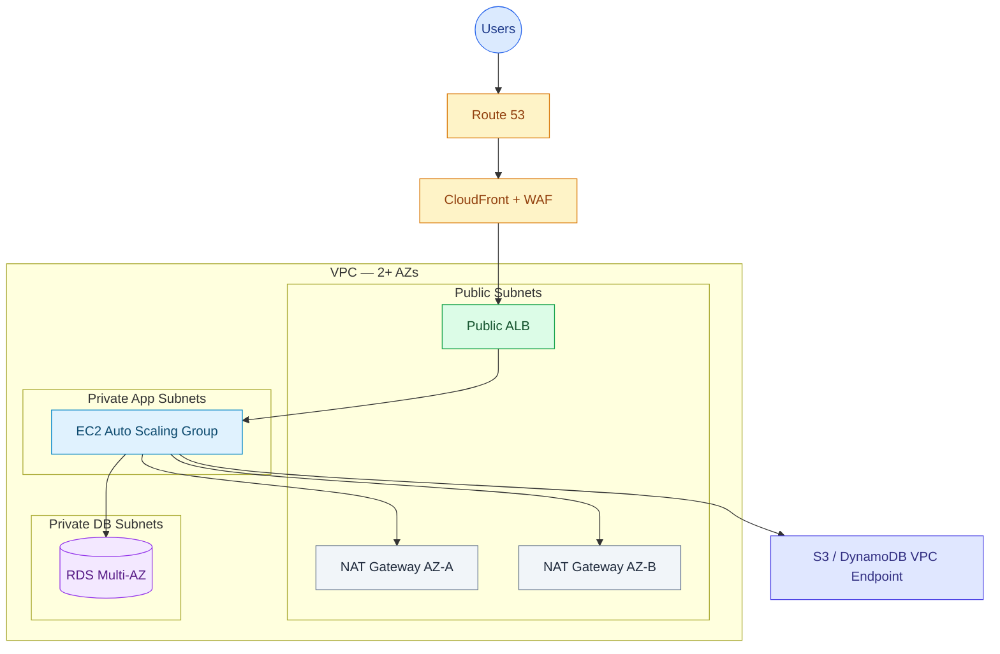

Chọn khi:

- Web/app truyền thống.
- Cần HA trong một Region.
- Cần bảo mật: ALB public, app/db private.
- Cần scale EC2 theo tải.

Điểm thi:

- [RDS](../01-core-services/databases.md) Multi-AZ cho failover.
- Read Replica nếu đọc nhiều.
- Security Group DB chỉ allow từ SG app.
- CloudFront + [WAF](../00-start-here/glossary.md#waf) nếu global/web protection.
- [VPC endpoint](../01-core-services/networking.md#vpc-endpoints) để private access S3/DynamoDB và giảm [NAT](../00-start-here/glossary.md#nat) cost.

---

## 2. Static Website Global

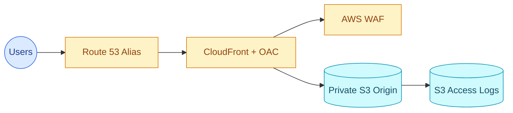

Chọn khi:

- React/Vue/Angular/static content.
- Global low latency.
- Low cost, high durability.

Điểm thi:

- [CloudFront Origin Access Control (OAC)](../00-start-here/glossary.md#oac--oai) giữ S3 không public.
- [ACM](../00-start-here/glossary.md#acm) certificate cho CloudFront phải tạo ở **us-east-1**.
- S3 lifecycle cho logs/assets cũ.

---

## 3. Serverless API

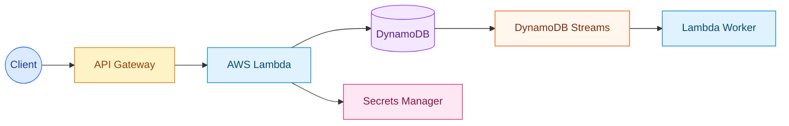

Chọn khi:

- Traffic biến động.
- Muốn least operational overhead.
- Event-driven API ngắn.

Điểm thi:

- Lambda timeout tối đa 15 phút ([Cold start](../00-start-here/glossary.md#cold-start) giảm bằng Provisioned Concurrency).
- DynamoDB on-demand cho unpredictable traffic.
- [DAX](../00-start-here/glossary.md#dax) cho read-heavy low latency.
- RDS Proxy nếu Lambda gọi [RDS](../00-start-here/glossary.md#rds).

---

## 4. Fan-Out Event Processing

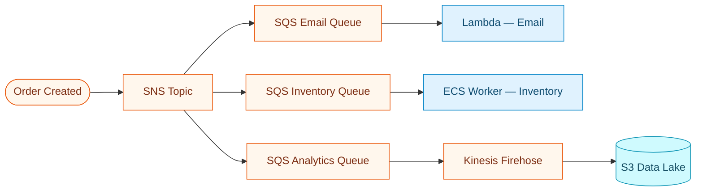

Chọn khi:

- Một event cần nhiều consumer độc lập.
- Không muốn consumer ảnh hưởng nhau.
- Cần DLQ/retry theo từng workflow.

Điểm thi:

- [SNS](../00-start-here/glossary.md#sns) [fan-out](../00-start-here/glossary.md#fan-out).
- [SQS](../00-start-here/glossary.md#sqs) per consumer để [decouple](../00-start-here/glossary.md#decouple--loose-coupling).
- [DLQ](../00-start-here/glossary.md#dlq) để xử lý lỗi.

---

## 5. Queue-Based Worker Scaling

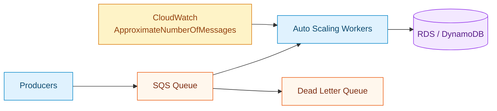

Chọn khi:

- Traffic spike.
- Worker xử lý lâu.
- Cần backpressure.

Điểm thi:

- Scale worker theo queue depth (metric `ApproximateNumberOfMessages`).
- [Visibility Timeout](../00-start-here/glossary.md#visibility-timeout) > max processing time.
- [DLQ](../00-start-here/glossary.md#dlq) after maxReceiveCount.

---

## 6. Container Microservices

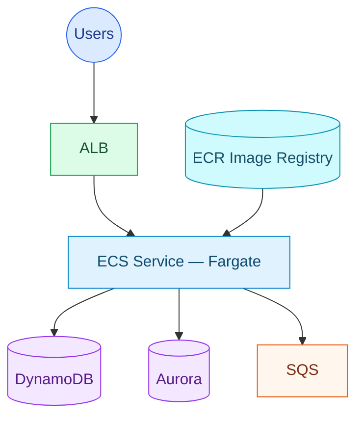

Chọn khi:

- App đã containerized.
- Cần giảm quản lý EC2.
- Microservices scale độc lập.

Điểm thi:

- Fargate = less ops.
- ECS on EC2 = more control/cost tuning.
- EKS nếu yêu cầu Kubernetes.

---

## 7. Hybrid Storage

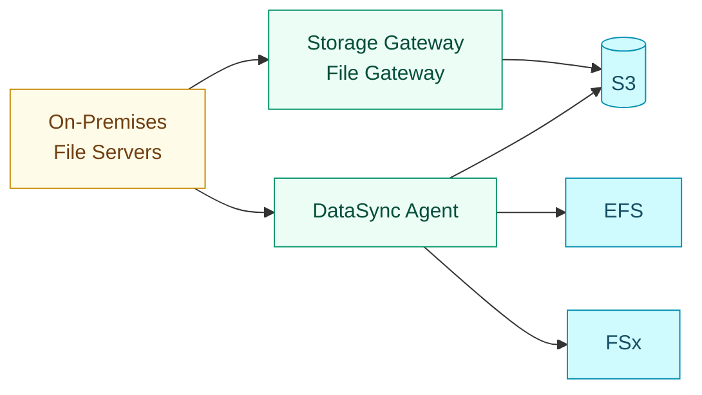

Chọn khi:

- On-prem app cần NFS/SMB local interface: Storage Gateway.
- Cần migrate/sync file nhanh: DataSync.
- Cần archive tape replacement: Tape Gateway.

---

## 8. Database Migration With Low Downtime

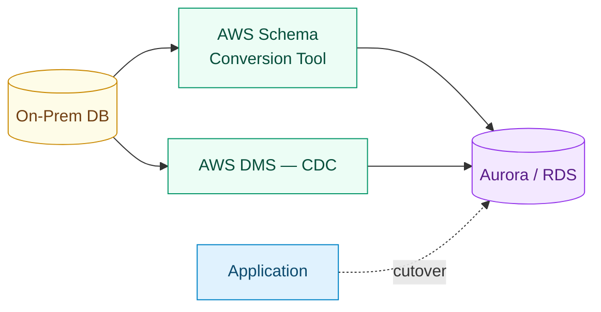

Chọn khi:

- Migrating database to AWS.
- Minimal downtime.
- Homogeneous hoặc heterogeneous migration.

Điểm thi:

- Heterogeneous: [SCT](../00-start-here/glossary.md#sct) + [DMS](../00-start-here/glossary.md#dms).
- Ongoing replication/[CDC](../00-start-here/glossary.md#cdc) để giảm downtime.

---

## 9. Multi-Region Disaster Recovery

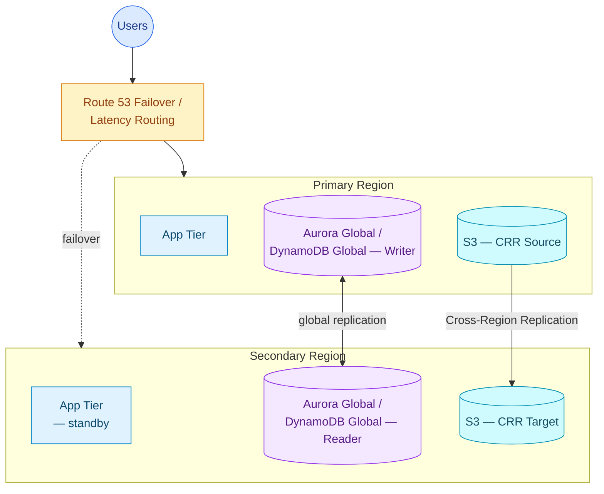

DR strategies:

| Strategy | Cost | [RTO](../00-start-here/glossary.md#rto) / [RPO](../00-start-here/glossary.md#rpo) | Khi dùng |
|---|---:|---:|---|
| Backup and restore | Thấp | Cao | Cost-first, downtime chấp nhận được |
| [Pilot light](../00-start-here/glossary.md#pilot-light) | Thấp-vừa | Trung bình | Core data/services always ready |
| [Warm standby](../00-start-here/glossary.md#warm-standby) | Vừa-cao | Thấp | Reduced-capacity environment ready |
| [Active-active](../00-start-here/glossary.md#active-active) | Cao | Rất thấp | Global critical workload |

Điểm thi:

- [RTO](../00-start-here/glossary.md#rto) = thời gian khôi phục dịch vụ.
- [RPO](../00-start-here/glossary.md#rpo) = lượng dữ liệu có thể mất.
- [Multi-AZ](../00-start-here/glossary.md#multi-az) không thay thế [Multi-Region](../00-start-here/glossary.md#multi-region) DR.

---

## 10. Data Lake Analytics

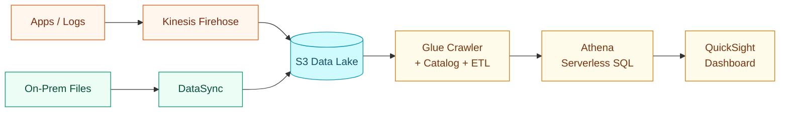

Chọn khi:

- Logs/events/file data tập trung ở S3.
- Query serverless bằng Athena.
- Transform/catalog bằng Glue.
- Dashboard bằng QuickSight.

---

## 11. Private AWS Service Access

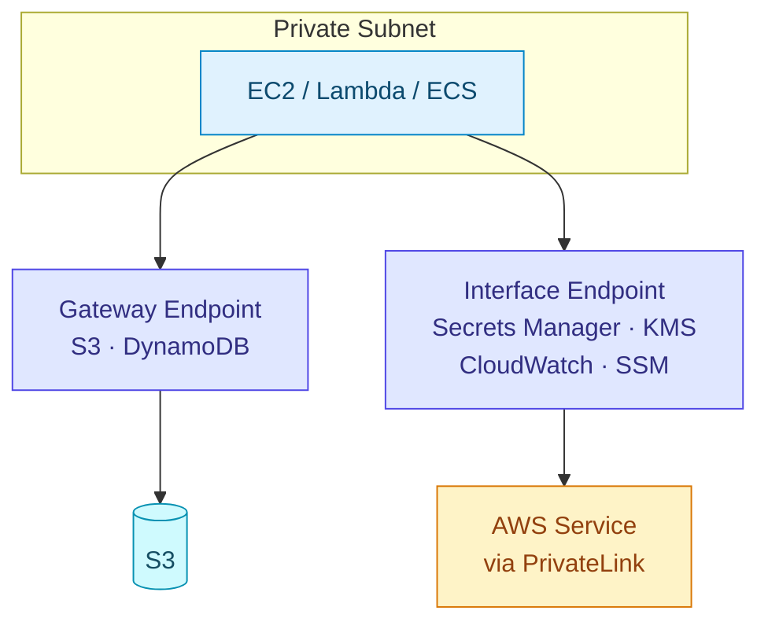

Chọn khi:

- Private subnet cần gọi AWS services không qua internet.
- Muốn giảm NAT cost cho S3/DynamoDB.
- Muốn chặt security bằng endpoint policy.

---

## Pattern Selection

| Nếu đề nói                     | Pattern                 |
| ------------------------------ | ----------------------- |
| Web app HA, private database   | Secure 3-tier           |
| Static assets global           | Static website global   |
| No servers, variable traffic   | Serverless API          |
| One event triggers many flows  | Fan-out                 |
| Workers overloaded by spikes   | Queue-based scaling     |
| Docker app, less ops           | Container microservices |
| On-prem files to AWS           | Hybrid storage          |
| DB migration low downtime      | DMS CDC                 |
| Region failure requirement     | Multi-Region DR         |
| Query logs in S3               | Data lake analytics     |
| Private subnet calling AWS API | VPC endpoints           |

## Liên Kết

- [Service Selection Matrix](service-selection-matrix.md)
- [High-Yield Comparisons](high-yield-comparisons.md)
- [Mock Exam 01](../03-exam-practice/mock-exam-01.md)
