# Architecture Patterns

File này gom các kiến trúc hay gặp trong SAA-C03. Khi luyện đề, hãy tập đọc requirement rồi map về một pattern gần nhất.

## 1. Secure 3-Tier Web Architecture

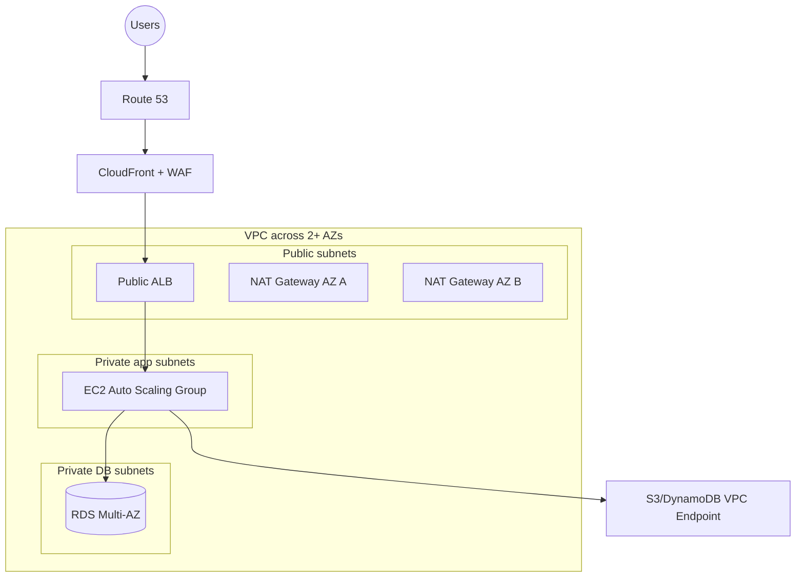

Chọn khi:

- Web/app truyền thống.
- Cần HA trong một Region.
- Cần bảo mật: ALB public, app/db private.
- Cần scale EC2 theo tải.

Điểm thi:

- RDS Multi-AZ cho failover.
- Read Replica nếu đọc nhiều.
- Security Group DB chỉ allow từ SG app.
- CloudFront + WAF nếu global/web protection.
- VPC endpoint để private access S3/DynamoDB và giảm NAT cost.

## 2. Static Website Global

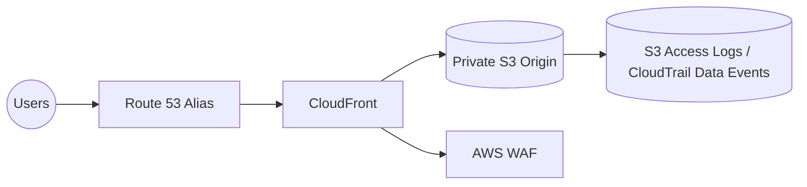

Chọn khi:

- React/Vue/Angular/static content.
- Global low latency.
- Low cost, high durability.

Điểm thi:

- Use CloudFront Origin Access Control để S3 không public.
- ACM certificate cho CloudFront ở us-east-1.
- S3 lifecycle cho logs/assets cũ.

## 3. Serverless API

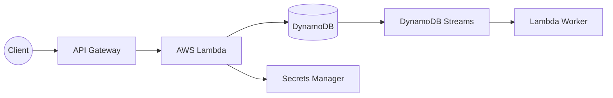

Chọn khi:

- Traffic biến động.
- Muốn least operational overhead.
- Event-driven API ngắn.

Điểm thi:

- Lambda timeout tối đa 15 phút.
- DynamoDB on-demand cho unpredictable traffic.
- DAX cho read-heavy low latency.
- RDS Proxy nếu Lambda gọi RDS.

## 4. Fan-Out Event Processing

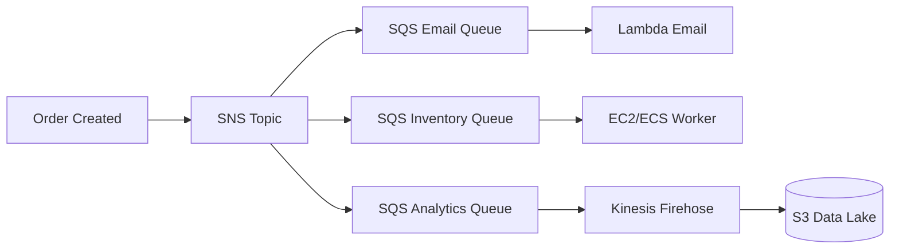

Chọn khi:

- Một event cần nhiều consumer độc lập.
- Không muốn consumer ảnh hưởng nhau.
- Cần DLQ/retry theo từng workflow.

Điểm thi:

- SNS fan-out.
- SQS per consumer để decouple.
- DLQ để xử lý lỗi.

## 5. Queue-Based Worker Scaling

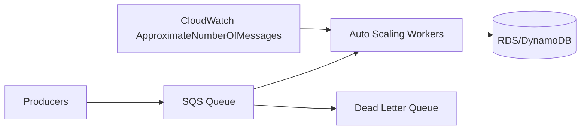

Chọn khi:

- Traffic spike.
- Worker xử lý lâu.
- Cần backpressure.

Điểm thi:

- Scale worker theo queue depth.
- Visibility timeout > max processing time.
- DLQ after maxReceiveCount.

## 6. Container Microservices

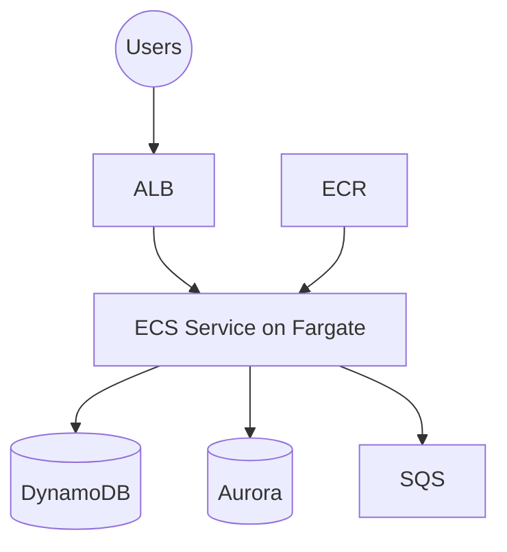

Chọn khi:

- App đã containerized.
- Cần giảm quản lý EC2.
- Microservices scale độc lập.

Điểm thi:

- Fargate = less ops.
- ECS on EC2 = more control/cost tuning.
- EKS nếu yêu cầu Kubernetes.

## 7. Hybrid Storage

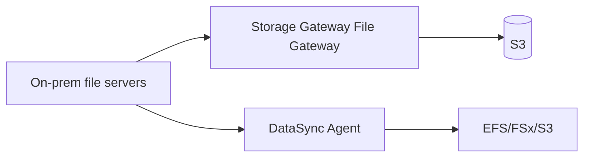

Chọn khi:

- On-prem app cần NFS/SMB local interface: Storage Gateway.
- Cần migrate/sync file nhanh: DataSync.
- Cần archive tape replacement: Tape Gateway.

## 8. Database Migration With Low Downtime

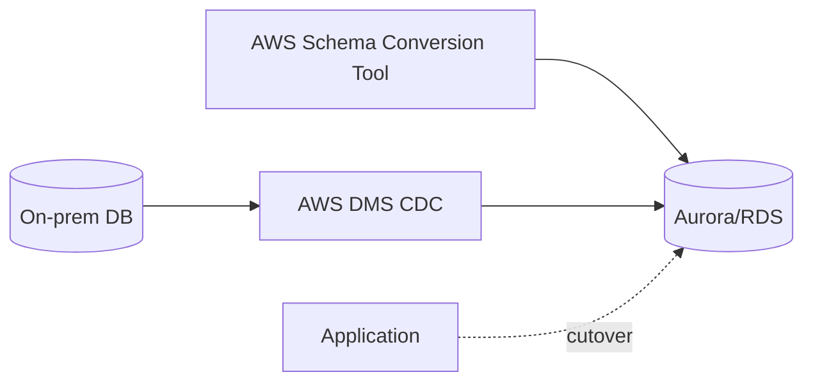

Chọn khi:

- Migrating database to AWS.
- Minimal downtime.
- Homogeneous hoặc heterogeneous migration.

Điểm thi:

- Heterogeneous: SCT + DMS.
- Ongoing replication/CDC để giảm downtime.

## 9. Multi-Region Disaster Recovery

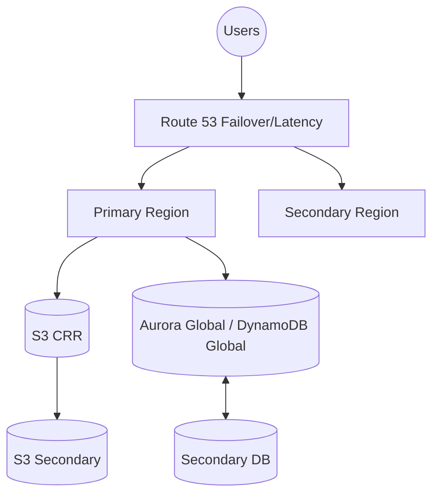

DR strategies:

| Strategy | Cost | RTO/RPO | Khi dùng |
|---|---:|---:|---|
| Backup and restore | Thấp | Cao | Cost-first, downtime chấp nhận được |
| Pilot light | Thấp-vừa | Trung bình | Core data/services always ready |
| Warm standby | Vừa-cao | Thấp | Reduced-capacity environment ready |
| Active-active | Cao | Rất thấp | Global critical workload |

Điểm thi:

- RTO = thời gian khôi phục.
- RPO = lượng dữ liệu có thể mất.
- Multi-AZ không thay thế multi-Region DR.

## 10. Data Lake Analytics

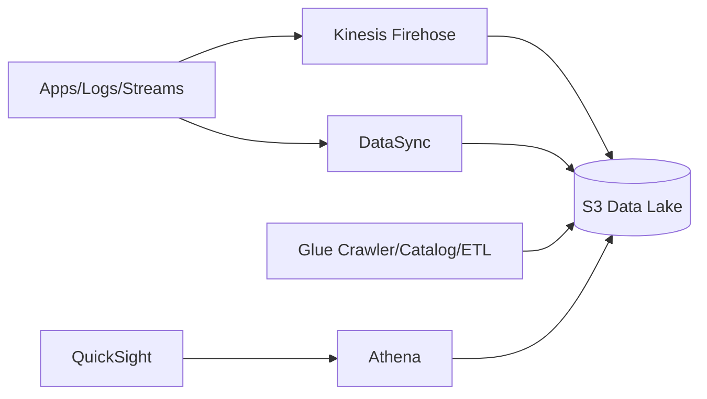

Chọn khi:

- Logs/events/file data tập trung ở S3.
- Query serverless bằng Athena.
- Transform/catalog bằng Glue.
- Dashboard bằng QuickSight.

## 11. Private AWS Service Access

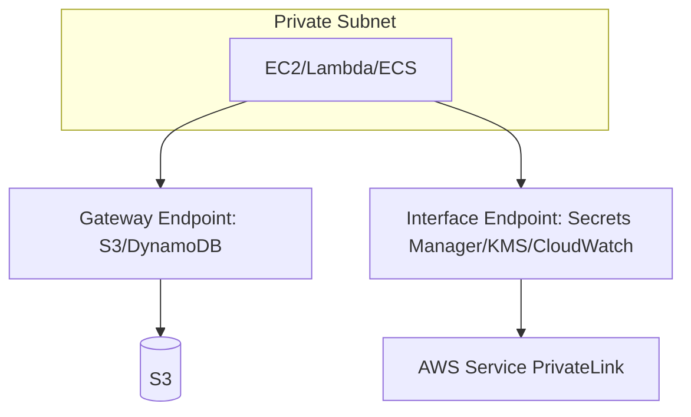

Chọn khi:

- Private subnet cần gọi AWS services không qua internet.
- Muốn giảm NAT cost cho S3/DynamoDB.
- Muốn chặt security bằng endpoint policy.

## Pattern Selection

| Nếu đề nói | Pattern |
|---|---|
| Web app HA, private database | Secure 3-tier |
| Static assets global | Static website global |
| No servers, variable traffic | Serverless API |
| One event triggers many flows | Fan-out |
| Workers overloaded by spikes | Queue-based scaling |
| Docker app, less ops | Container microservices |
| On-prem files to AWS | Hybrid storage |
| DB migration low downtime | DMS CDC |
| Region failure requirement | Multi-Region DR |
| Query logs in S3 | Data lake analytics |
| Private subnet calling AWS API | VPC endpoints |

## Liên Kết

- [Service Selection Matrix](service-selection-matrix.md)
- [High-Yield Comparisons](high-yield-comparisons.md)
- [Mock Exam 01](../03-exam-practice/mock-exam-01.md)
