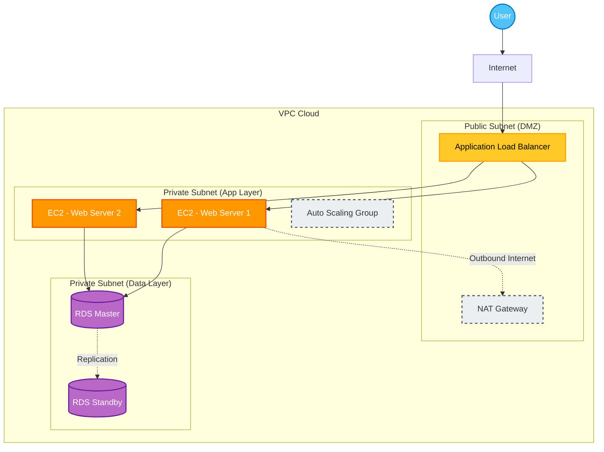
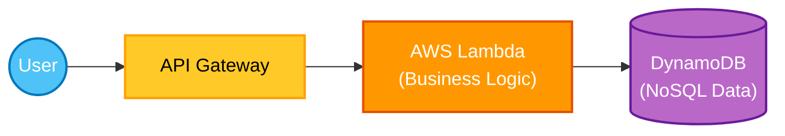
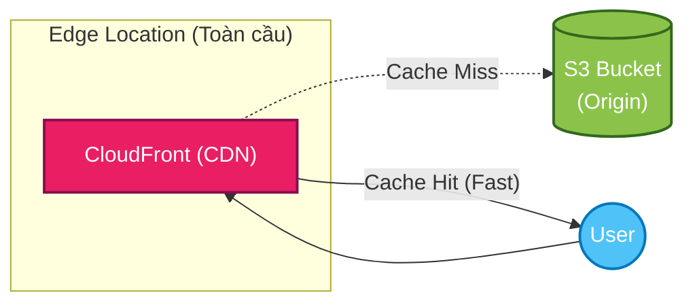
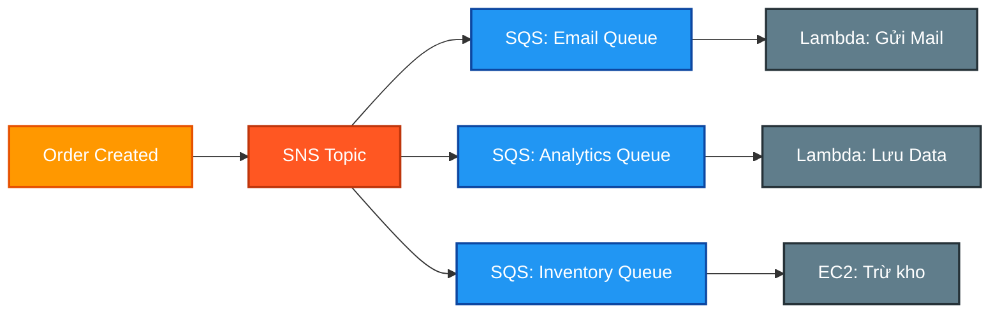

# AWS Architecture Patterns (Common Combos)

Tài liệu này tổng hợp các mô hình kiến trúc phổ biến nhất trên AWS mà bạn sẽ gặp thường xuyên trong thực tế và các kỳ thi chứng chỉ.

---

## 1. 3-Tier Web Architecture (Kiến trúc Web 3 Lớp cổ điển)

Đây là "nền tảng" của hầu hết các ứng dụng doanh nghiệp.

### Mô hình

### Chi tiết
1.  **Public Subnet**: Chứa **Load Balancer (ALB)** và **NAT Gateway**. Đây là nơi duy nhất tiếp xúc trực tiếp với Internet.
2.  **Private Subnet (App)**: Chứa các **EC2 Instance**. Các server này **KHÔNG** có Public IP. Chúng chỉ nhận request từ ALB.
3.  **Private Subnet (Data)**: Chứa **RDS Database**. Được bảo vệ kỹ nhất, chỉ cho phép EC2 ở lớp App truy cập (qua Security Group).

### Khi nào dùng?
*   Hệ thống Enterprise, E-commerce cần bảo mật cao.
*   Cần sự ổn định và kiểm soát server truyền thống.
*   Dễ dàng Audit và tuân thủ các chuẩn bảo mật (PCI-DSS).

---

## 2. Serverless Architecture (Kiến trúc Hiện đại)

Mô hình này giúp bạn quên đi nỗi lo quản lý server. "Pay-as-you-go" (Dùng bao nhiêu trả bấy nhiêu).

### Mô hình

### Chi tiết
1.  **API Gateway**: Nhận HTTP Request từ Client, đóng vai trò như cửa ngõ, có thể Throttle (giới hạn tốc độ) và Auth.
2.  **Lambda**: Chạy code xử lý logic khi có request. Tự động scale từ 0 lên 10.000 request/giây mà không cần cấu hình.
3.  **DynamoDB**: Lưu trữ dữ liệu dạng Key-Value cực nhanh. Tự động scale.

### Khi nào dùng?
*   Startup, MVP (Sản phẩm demo) cần ra mắt nhanh.
*   Ứng dụng có lượng truy cập biến động mạnh (lúc vắng tanh, lúc bùng nổ).
*   API Restful đơn giản.

---

## 3. High Performance Static Web (S3 + CloudFront)

Cách rẻ nhất và nhanh nhất để host một trang web frontend (React, Angular, Vue).

### Mô hình

### Chi tiết
1.  **S3 Bucket**: Chứa file code web (HTML, CSS, JS, Images). S3 được cấu hình làm **Static Website Hosting**.
2.  **CloudFront**: Phân phối nội dung từ S3 ra các Edge Location trên toàn thế giới.
3.  **Lợi ích**: Người dùng ở Việt Nam sẽ tải web từ server CloudFront ở Việt Nam/Singapore thay vì tải từ S3 tận bên Mỹ -> Siêu nhanh.

### Khi nào dùng?
*   Web tin tức, Blog, Landing Page.
*   Single Page Application (SPA) viết bằng React/Vue/Angular.

---

## 4. Fan-out Pattern (SNS + SQS)

Mô hình xử lý song song, giúp một sự kiện kích hoạt nhiều hành động khác nhau.

### Mô hình

### Chi tiết
1.  **SNS Topic**: Nhận sự kiện gốc ("Có đơn hàng mới!").
2.  **SQS Queues**: Nhiều hàng đợi cùng đăng ký (Subscribe) vào 1 Topic. Khi SNS có tin, nó copy tin đó ném vào TẤT CẢ các Queue.
3.  **Workers**: Mỗi Worker chỉ việc lấy tin từ Queue của mình và làm việc riêng (Gửi mail, tính tiền, trừ kho) mà không ảnh hưởng lẫn nhau.

### Khi nào dùng?
*   Hệ thống E-commerce, Microservices.
*   Khi muốn thêm tính năng mới (VD: Gửi SMS) mà không muốn sửa code của luồng cũ. Chỉ cần tạo thêm Queue mới và subscribe vào SNS.
