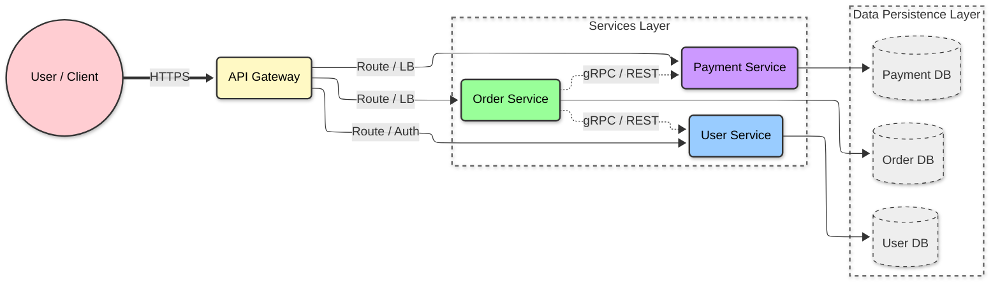
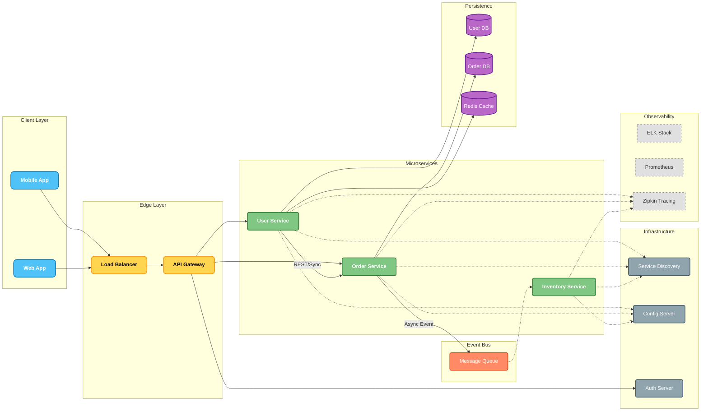

# Microservice Handbook

## Microservice là gì?

Microservices (Kiến trúc vi dịch vụ) là một phương pháp phát triển phần mềm mà ở đó ứng dụng được xây dựng như một tập hợp các dịch vụ nhỏ (services), độc lập với nhau.

Mỗi service:
- Chạy trên một tiến trình riêng (process).
- Giao tiếp với nhau thông qua các cơ chế nhẹ (thường là HTTP API hoặc Message Queue).
- Được xây dựng xung quanh một khả năng nghiệp vụ (business capability) cụ thể.
- Có thể triển khai độc lập (independently deployable).
- Quản lý cơ sở dữ liệu riêng (decentralized data management).

Nói đơn giản: Thay vì xây một tòa lâu đài khổng lồ (Monolith), chúng ta xây một ngôi làng gồm nhiều ngôi nhà nhỏ, mỗi nhà có chức năng riêng và có thể sửa chữa/nâng cấp riêng biệt.

## Microservice Architecture

Dưới đây là sơ đồ kiến trúc tổng quan.

> **Lưu ý**: Sơ đồ thể hiện luồng đi từ Client -> Gateway -> Services -> Database.

### Giải thích các thành phần:

1.  **API Gateway**:
    *   Cổng vào duy nhất (Single Entry Point).
    *   **Nhiệm vụ**: Xác thực (Auth), Định tuyến (Routing), Giới hạn tốc độ (Rate Limiting).
2.  **Service (User, Order, Payment)**:
    *   Các dịch vụ độc lập thực hiện business logic.
3.  **Giao thức giao tiếp (Communication Protocols)**:
    *   **REST (HTTP/JSON)**: Dễ hiểu, phổ biến. Thường dùng cho giao tiếp **Client -> Gateway**.
    *   **gRPC (Google Remote Procedure Call)**: Nhanh, nhẹ, dùng Protobuf. Thường dùng cho giao tiếp **Service -> Service** (Backend nội bộ) để tối ưu hiệu năng.
4.  **Database per Service**:
    *   Mỗi service quản lý DB riêng của nó để đảm bảo tính độc lập (Loose Coupling).

## Microservice tech stack 

Một hệ thống Microservice đầy đủ không chỉ có các service mà còn cần rất nhiều thành phần hỗ trợ (Infrastructure components).

Dưới đây là sơ đồ hệ thống đầy đủ bao gồm API Gateway, Message Queue, Service Discovery, v.v.

### Chi tiết Tech Stack & Vai trò trong hệ thống

Để vận hành một "bộ máy" Microservice trơn tru, chúng ta cần phối hợp nhiều công nghệ khác nhau. Dưới đây là giải thích chi tiết từng thành phần:

#### 1. Core Framework & Language
*   **Java / Spring Boot**:
    *   **Vai trò**: Là nền tảng để xây dựng từng service riêng lẻ (User Service, Order Service...).
    *   **Tại sao dùng?**: Spring Boot giúp tạo ứng dụng web cực nhanh (Stand-alone), có sẵn server nhúng (Embedded Tomcat), và hệ sinh thái thư viện khổng lồ hỗ trợ kết nối Database, Security, v.v.

#### 2. Edge Layer (Lớp biên - Cửa ngõ)
*   **API Gateway (Spring Cloud Gateway / Zuul)**:
    *   **Vai trò**: Là "bác bảo vệ" của toàn bộ hệ thống. Mọi request từ Client (Mobile, Web) đều phải qua đây.
    *   **Chức năng chi tiết**:
        *   **Routing**: Điều hướng request đến đúng service (VD: `/users` -> User Service, `/orders` -> Order Service).
        *   **Security**: Xác thực user (đăng nhập chưa?) tại 1 nơi duy nhất thay vì check ở từng service.
        *   **Load Balancing**: Phân tải nếu backend có nhiều instance.
*   **Load Balancer (Nginx / HAProxy)**: Đứng trước Gateway để phân tải traffic từ Internet vào các cụm Gateway.

#### 3. Service Management (Quản lý Service)
*   **Service Discovery (Netflix Eureka / Consul)**:
    *   **Vấn đề**: Trong Cloud, các service có thể khởi động/tắt liên tục, IP thay đổi liên tục. Service A không thể "hard-code" IP của Service B.
    *   **Giải pháp**: Eureka đóng vai trò như một "cuốn danh bạ điện thoại".
        *   Khi Service B khởi động, nó đăng ký IP/Port với Eureka (tôi đang ở đây!).
        *   Khi Service A cần gọi B, nó hỏi Eureka "Cho tôi địa chỉ nhà thằng B", Eureka trả về IP mới nhất.
*   **Config Server (Spring Cloud Config)**:
    *   **Vai trò**: Quản lý file cấu hình (`app.properties`, `app.yml`) tập trung tại 1 nơi (thường là Git repo).
    *   **Lợi ích**: Muốn sửa cấu hình DB hay tắt bật tính năng, chỉ cần sửa trên Git, không cần build lại code hay restart từng service thủ công.

#### 4. Communication (Giao tiếp)
*   **Rest Template / OpenFeign**: Dùng cho giao tiếp đồng bộ (Synchronous). Service A gọi B và chờ B trả lời ngay (như gọi điện thoại).
*   **Message Queue (Kafka / RabbitMQ)**:
    *   **Vai trò**: Dùng cho giao tiếp bất đồng bộ (Asynchronous).
    *   **Cơ chế**: Service A (Publisher) gửi 1 tin nhắn "Vừa có đơn hàng mới" vào Queue rồi tiếp tục làm việc khác. Service B (Consumer - Kho vận) nghe thấy tin nhắn thì tự động xử lý (trừ kho).
    *   **Lợi ích**: Giúp hệ thống không bị "treo" khi waiting, và nếu Service B chết thì tin nhắn vẫn nằm trong Queue chờ B sống lại xử lý (đảm bảo không mất dữ liệu).

#### 5. Resilience & Fault Tolerance (Khả năng chịu lỗi)
*   **Circuit Breaker (Resilience4j / Hystrix)**:
    *   **Vai trò**: "Cầu chì" ngắt mạch.
    *   **Tình huống**: Nếu Service B bị lỗi (chết hoặc quá tải), Service A gọi B sẽ bị lỗi theo (hiệu ứng domino).
    *   **Hoạt động**: Circuit Breaker sẽ phát hiện B đang lỗi và lập tức "ngắt cầu chì", trả về lỗi giả (fallback) cho A ngay lập tức mà không cần chờ timeout. Giúp hệ thống không bị sập dây chuyền.

#### 6. Observability (Giám sát & Theo dõi)
*   **Distributed Tracing (Zipkin / Jaeger)**:
    *   **Vấn đề**: 1 Request đi qua 5 service. Nếu chậm thì chậm ở đâu?
    *   **Giải pháp**: Gán ID cho mỗi Request (Trace ID). Zipkin sẽ vẽ lại bản đồ đường đi của request đó, biết chính xác nó tốn bao nhiêu giây ở Service nào.
*   **Logging (ELK Stack - Elasticsearch, Logstash, Kibana)**: Gom log từ 100 service về 1 chỗ để dễ search lỗi.
*   **Monitoring (Prometheus + Grafana)**: Theo dõi sức khỏe hệ thống (CPU, RAM, số lượng request/giây) và cảnh báo khi có sự cố.

## Microservice vs Monolithic

| Đặc điểm | Monolithic (Nguyên khối) | Microservices (Vi dịch vụ) |
| :--- | :--- | :--- |
| **Cấu trúc** | Một khối code duy nhất, mọi component dính liền nhau. | Tập hợp các service nhỏ, độc lập. |
| **Database** | Dùng chung 1 Database khổng lồ. | Mỗi service có Database riêng (Database per service). |
| **Deploy** | Sửa 1 dòng code cũng phải deploy lại cả cục to. Rủi ro cao. | Deploy từng service nhỏ. Nhanh và ít rủi ro. |
| **Scalability** | Scale cả cục (kể cả module không dùng nhiều). Tốn kém. | Scale đúng service đang chịu tải cao. Tiết kiệm tài nguyên. |
| **Công nghệ** | Bị khóa chặt vào 1 công nghệ (VD: Chỉ dùng Java). | Linh hoạt. Service A dùng Java, Service B dùng Node.js, Service C dùng Go. |
| **Đội ngũ** | Team lớn làm chung code base, dễ dẫm chân lên nhau. | Chia thành các team nhỏ (scrum team) quản lý từng service. |

## Vấn đề khi áp dụng microservice

Không có "bữa trưa nào miễn phí" (No Silver Bullet). Microservice mang lại sự linh hoạt nhưng cái giá phải trả là **Sự phức tạp (Complexity)**.

1.  **Độ phức tạp vận hành (Operational Complexity)**:
    *   Thay vì quản lý 1 server, bạn phải quản lý hàng chục, hàng trăm service, container, pod.
    *   Bắt buộc phải có kiến thức về DevOps, Container (Docker), Orchestration (Kubernetes), CI/CD.

2.  **Giao tiếp giữa các service (Inter-service Communication)**:
    *   Gọi hàm nội bộ (in-process) rất nhanh và an toàn. Gọi qua mạng (network) thì chậm và dễ lỗi (latency, timeout, network partition).
    *   Cần xử lý các kịch bản lỗi (Circuit Breaker, Retry).

3.  **Quản lý giao dịch phân tán (Distributed Transactions)**:
    *   Ở Monolith, dùng transaction của Database (ACID) rất dễ.
    *   Ở Microservice, data nằm rải rác. Làm sao để rollback khi Service A thành công nhưng Service B thất bại? -> Phải dùng **Saga Pattern** (Event-driven architecture), rất phức tạp để code và debug.

4.  **Khó khăn khi Debug & Test**:
    *   Một request đi qua 10 service. Nếu lỗi, nó lỗi ở đâu? Cần hệ thống Distributed Tracing.
    *   Integration test cho toàn bộ hệ thống rất khó khăn.
