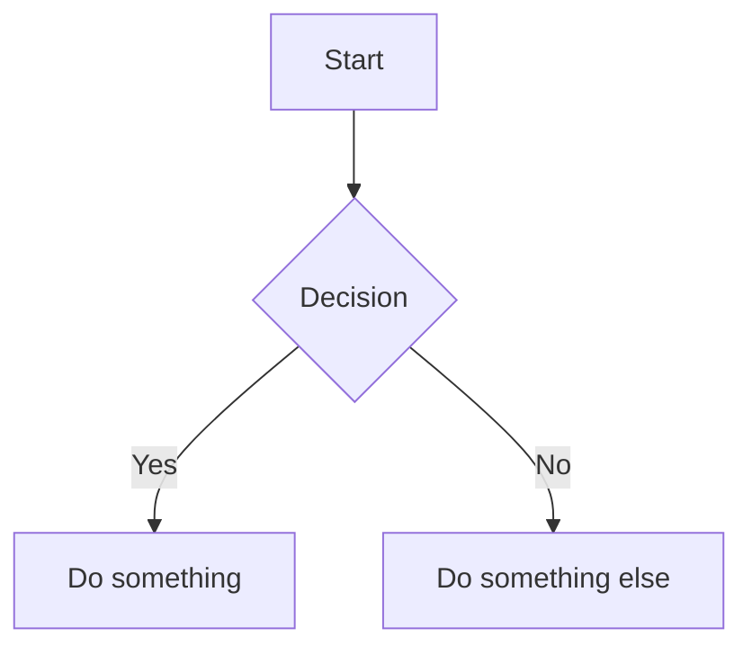

# Microservice Handbook

# Microservice là gì?

# Microservice Architecture 

# Vấn đề khi áp dụng microservice

```mermaid
graph TD
  A[Start] --> B{Decision}
  B -->|Yes| C[Do something]
  B -->|No| D[Do something else]
```
